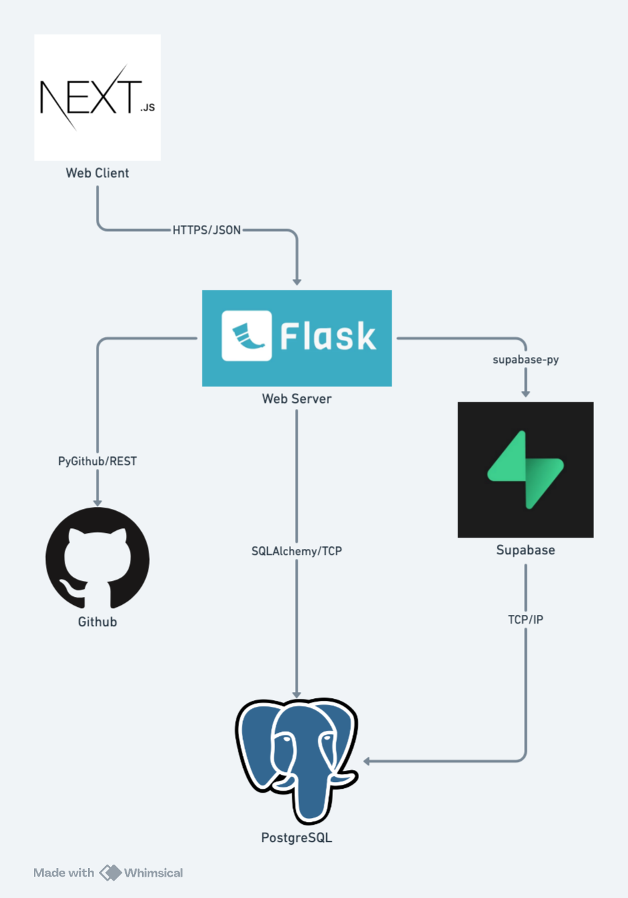

# ResumeTailor Architecture

## High-Level Component Diagram

ResumeTailor follows a modern web application architecture with three distinct layers. At the frontend, a Next.js web client serves as the user interface, handling all user interactions and making HTTPS/JSON API calls to the backend. The middle layer consists of a Flask web server that acts as the central coordinator, processing incoming requests and managing communication with external services. This server interacts with three key external services: GitHub for repository data (via PyGithub making REST calls), Supabase for authentication (using supabase-py over TCP), and a PostgreSQL database for data persistence (accessed through SQLAlchemy over TCP). When users interact with the frontend, requests flow through the Flask server, which orchestrates the necessary calls to GitHub for repository information, Supabase for user authentication, and PostgreSQL for data storage and retrieval. This layered approach ensures clean separation of concerns while maintaining efficient communication pathways between components.