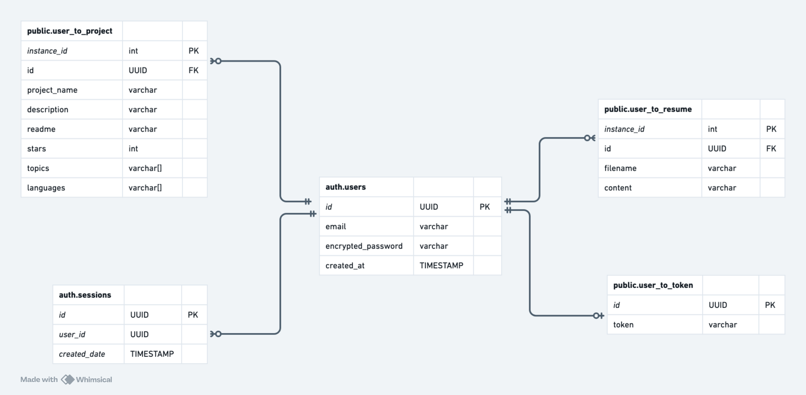

# ResumeTailor Architecture

## High-Level Component Diagram

ResumeTailor follows a modern web application architecture with three distinct layers. At the frontend, a Next.js web client serves as the user interface, handling all user interactions and making HTTPS/JSON API calls to the backend. The middle layer consists of a Flask web server that acts as the central coordinator, processing incoming requests and managing communication with external services. This server interacts with three key external services: GitHub for repository data (via PyGithub making REST calls), Supabase for authentication (using supabase-py over TCP), and a PostgreSQL database for data persistence (accessed through SQLAlchemy over TCP). When users interact with the frontend, requests flow through the Flask server, which orchestrates the necessary calls to GitHub for repository information, Supabase for user authentication, and PostgreSQL for data storage and retrieval. This layered approach ensures clean separation of concerns while maintaining efficient communication pathways between components.

## Entity-Relationship Diagram

The database architecture of ResumeTailor consists of interconnected tables managed by both Supabase authentication and custom public schemas. The core auth_users table maintains user identities with unique UUIDs, email addresses, and encrypted passwords. This table forms relationships with several other entities: it maintains multiple sessions through auth_sessions, tracks multiple GitHub projects via public_user_to_project (storing project details including name, readme, stars, and arrays of topics and languages), manages multiple resumes through public_user_to_resume (containing filename and content), and holds exactly one GitHub authentication token in public_user_to_token. The schema uses UUID foreign keys to maintain referential integrity, with instance_id serving as auto-incrementing primary keys in the project and resume tables. Notably, all project and resume data is linked back to users through their UUID, creating a well-organized hierarchical structure that supports the application's core features of GitHub integration and resume management.
