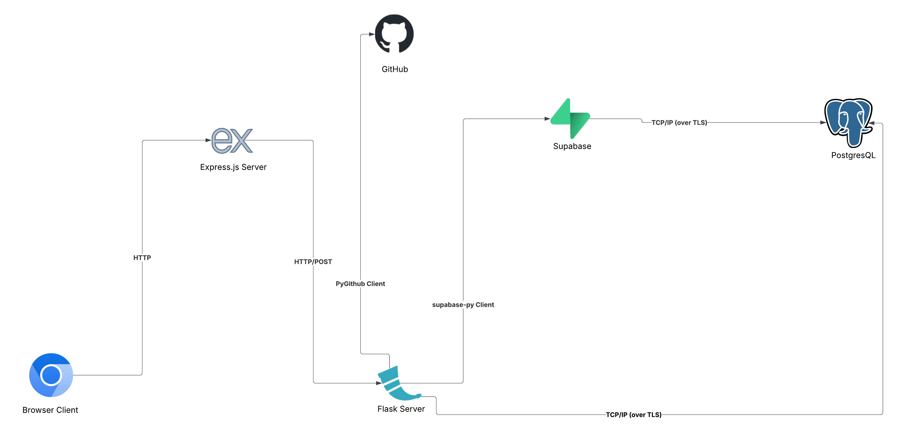
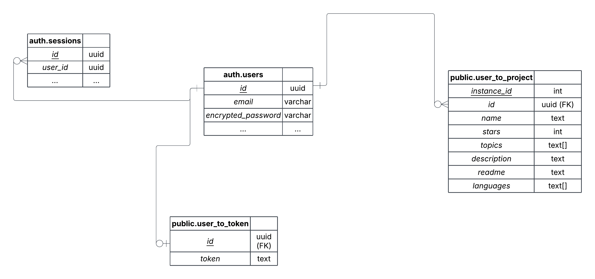
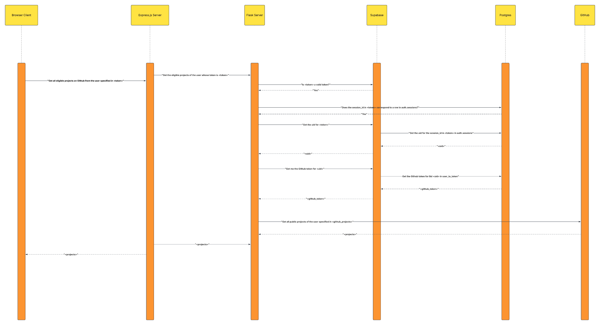

# High-Level Component Diagram

The above high-level component diagram describes the architecture of ResumeTailor: the website is divided into two stacks --- the frontend, and the backend. The frontend stack consists of an Express.js server (_E_), while the backend stack consists of a Flask server (_F_).

Since the _E_ is the user-facing part of the site, the routes it handles are divided into two categories: **views** and **API calls**. The **view** routes return rendered HTML templates, while the **API** routes are essentially proxies to the corresponding routes in _F_. All of the routes in _E_ and _F_ receive requests and send responses over HTTP/S.

All of the routes in _F_ are API routes that only take POST requests, and return JSON responses. Depending on the specific route, _F_ makes calls to a subset of {GitHub, Supabase, Supabase's PostgreSQL servers}. When _F_ makes calls to GitHub and/or Supabase, it uses native Python clients (`PyGithub` and `supabase-py`, respectively), while calls to Supabase's PostgreSQL servers are directly over TCP/IP (with optional TLS encryption). Both of the Python clients (presumably) make RESTful HTTP/S API calls to their respective services under the hood.

Upon receiving a request from _F_, Supabase (and presumably GitHub), interacts with their own database(s) on their end.

# Entity Diagram

The above entity relation diagram describes all of the tables that ResumeTailor (currently) uses, as well as the relationships, if any, between them. The **auth.users** and **auth.sessions** tables are internally managed by Supabase --- while ResumeTailor does not write to these tables directly, it does read from it when it validates tokens. Therefore, the ER diagram does not display any column from these tables that is not pertinent or relevant to the operation of ResumeTailor (however, it of course displays all of the columns of the tables that we directly maintain, i.e., all of the tables in the **public** namespace).

As a short guide to reading this diagram --- each table in our database is presented as a two-column table. The **boldened** text in the first column of the first row in each of these tables is the name of the table. For all subsequent rows, the first column has _italicized_ text and holds the name of a column in the table, while the second column has unformatted text and holds the type of the corresponding column in the table. The second row in each table describes the primary key column (this column is used to store a unique identifier for each row) --- for this row, the column name is <ins>underlined</ins>.

None of the columns in any of the tables are allowed to be NULL (however, some columns are allowed to be empty; e.g., _public.user_to_project.readme_ is allowed to be set to `""`, and _public.user_to_project.languages_ is allowed to be set to `[]`).

The **auth.sessions** table holds information about users' logged in sessions --- in particular, the _user_id_ column is used to link a given session to the logged-in user of that session.

The **auth.users** table holds the essential profile information about each user. The _email_ and _encrypted_password_ columns are used to store a new user's credentials during the sign-up process, and for authenticating users during the sign-in flow.

The **public.user_to_token** table maps users to GitHub tokens. Since the primary key of this table is also a foreign key that is linked to _auth.users.id_, every user can have at most one token linked to their accounts (at the beginning of this project, we were thinking of allowing multiple GitHub accounts per user, but we ultimately decided against it for now (at least for our MVP), as it would complicate our planned UX).

The most important table is **public.user_to_project**, which holds the imported data from users' GitHub projects. Obviously, a given user can have 0, 1, or many rows in this table. The _topics_ and _languages_ columns have type `text[]`, which means that they store (possibly empty) lists of text. The _instance_id_ column is an identity column, which means that for each new row that is inserted, that column will be set to an auto-incrementing integer.

# Call Sequence Diagram

The above call sequence diagram describes how the different components of ResumeTailor interact with each other in order to respond to a request by the user to list all of their public GitHub projects: first, after the user has clicked the corresponding button, the client in the browser sends a request to the corresponding route in the Express.js server (_E_), along with the Supabase `token` that is stored as a browser cookie.

Next, _E_ calls the `/github/projects/list` route on the Flask server (_F_) (this of course glosses over the many filter options available that can be passed as parameters to the endpoint, as they do not change the actual flow presented in the diagram), along with the `token`.

Once the endpoint is called on _F_, _F_ verifies that `token` is valid (a valid token is one whose `session_id` has a row in **auth.sessions**. It is not enough to let Supabase verify the token's validity server-side --- although certain user operations, like changing a password, causes all of the user's logged-in sessions to be invalidated, logging out only causes the corresponding session to merely "expire". The problem with this is that Supabase's validation, by design, allows tokens that expired less than 24 hours ago (after 24 hours, the tokens are properly invalidated). This means that a malicious party who was able to get access to an access token, after the corresponding user has already logged out, could still use it for 24 hours. To close off this avenue for abuse, ResumeTailor added an internal check). This is done by decoding `token`, and looking up the `session_id` stored in `token` directly in the **auth.sessions** table in Supabase's database (_D_).

Once _D_ confirms that there is a row with an _id_ column that equals `session_id` in the table, _F_ then retrieves the uid (user id) from the token. This is done by calling `auth.get_user(token)` in `supabase-py`, which sends a request Supabase, which in turn queries _D_ by looking up, in the **auth.sessions** table, the _user_id_ column for the row whose _id_ column equals the `session_id` in `token` (_F_ knows this row *must* exist, as in the course of doing its own validation, it has just checked for the existence of the row. However, it is still possible for the token to have expired between the validation and the `get_user` call; however, in this highly unlikely event, _F_ will just respond with a `StaleTokenError`, which will indicate to _E_ to call `/refresh` to get a new token).

Once _F_ has received the `uid` from _D_, _F_ then retrieves the GitHub token linked to `uid` by making a `table.select.eq.execute` call with `supabase-py`, which sends a request to Supabase, which in turns queries _D_ by looking up the _token_ column in the **public.user_to_token** table for the row whose _id_ column equals `uid`.

Once _F_ receives the GitHub token (`github_token`), it then retrieves the list of public repos (`repos`) from the user specified by `github_token`. This is done by calling `Github.get_user(github_token).get_tokens` from `PyGithub`, which sends a request to GitHub. Once retrieved, `repos` is then sent back to _E_ from _F_ as a response to the request. _E_, in turn, returns the received `repos` to the browser client as a response to the request. The browser client finally formats the returned JSON into something that can be displayed in the browser.
